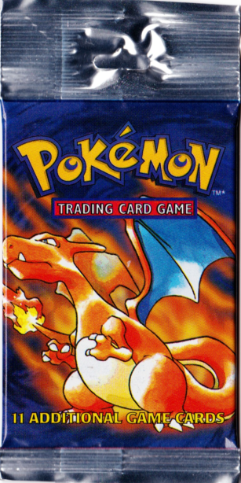

# Pokemon TCG Opener

Pokemon is so awesome so go create a Pokemon trading card pack opener using HTML, CSS, and JS. This project will use skills you learned about DOM

An example of what the finished product may look like can be found here: https://pokemon-tcg-opener.alvin-edrada.repl.co/

## Difficulty
Intermediate

## Prerequisites
* HTML structuees and attributes
* Basic CSS styling
* Adding Elements in HTML using DOM
* Changing Elements in HTML using DOM
* Javascript functions
* Event listeners
* For loop

## Instructions (if doing easy template, skip to Part III: Javascript)

## Part I: HTML

1. Link your css file by adding ```<link href="style.css" rel="stylesheet" type="text/css" />``` inside your ```<head>``` element. 

2. We will also be adding a custom font from a website, so add this stylesheet ```<link href="https://fonts.cdnfonts.com/css/pokemon-solid" rel="stylesheet">``` into your ```head``` element as well.

3. Then link your javascript file by adding ```<script src="script.js"></script>``` into your ```body``` element.

4. In the ```body``` of the HTML file, create a ```div```. Place this before your javascript link ```script```.

5. Inside your newly made ```div```, create a ```h1``` header and make it say ```Click the Pokemon card pack to open it!```. Then create a ```h2``` header and make it say ```Then click on your cards to flip them!```.

6. After your two header elements, create the following with the correct nested indented structure below. (The img should be nested inside of the div):
  * ```div``` with an id of "pokemon-pack-cover"
    * ```img``` with a src linked to "/pokemon-cards/pack-cover.png"
  * ```div``` with an id of "opened-pokemon-cards"
  
  
<details>
      <summary>When done with the steps above, your HTML file should look like this:</summary>

``` HTML
<!DOCTYPE html>
<html>

<head>
  <meta charset="utf-8">
  <meta name="viewport" content="width=device-width">
  <title>replit</title>
  <link href="style.css" rel="stylesheet" type="text/css" />
  <link href="https://fonts.cdnfonts.com/css/pokemon-solid" rel="stylesheet">
</head>

<body>
  <div>
    <h1>Click the Pokemon card pack to open it!</h1>
    <h2>Then click on your cards to flip them!</h2>
    <div id="pokemon-pack-cover">
      
    </div>
    <div id="opened-pokemon-cards">
    </div>
  </div>
  <script src="script.js"></script>
</body>

</html>
```
</details>

## Part II: CSS
1. Import a custom font by pasting ```@import url('https://fonts.cdnfonts.com/css/pokemon-solid');``` at the top of your css file.

2. Target the ```body``` element.
  * Set the ```text-align``` to ```center```
  * Set the ```font-family``` to ```'Pokemon Solid', sans-serif;```
  * Set the ```letter-spacing``` to ```5px```
  * Set the ```margin``` to ```10px```
  * Create a flexbox by setting ```display``` to ```flex```
  * Set ```justify-content``` to ```center```
  
3. Target the ```#pokemon-pack-cover``` id.
  * Set the ```margin-top``` to ```20px```
  * Set the ```cursor``` to ```pointer``` (this changes the cursor when hovering over the image)
  
4. Target the ```#opened-pokemon-cards``` id.
  * Create a flexbox by setting ```display``` to ```flex```
  * Set ```justify-content``` to ```center```
  * Set ```flex-wrap``` to ```wrap```
  * Set ```max-width``` to ```1600px```
  
5. Target the ```.pokemon-card``` class.
  * Set ```margin``` to ```10px```
  * Set ```width``` to ```300px```
  * Set ```height``` to ```410px```
  * Set ```cursor``` to ```pointer```
  
6. Target the ```.pokemon-card img``` class and element
  * Set ```width``` to ```100%```
  * Set ```height``` to ```100%```
  * Set ```transition``` to ```transform 1.2s```. This creates a transformation event that takes 1.2 seconds long.
  * Set ```transform-style``` to ```preserve-3d```. This creates a 3D effect for your pokemon cards.
  
7. Target the ```.flipped``` class
  * Set ```transform``` to ```rotateY(360deg)```. This creates an animation that flips your image 360 degrees.
  * Set ```cursor``` to ```default```

<details>
      <summary>When done with the steps above, your CSS file should look like this:</summary>

``` CSS
@import url('https://fonts.cdnfonts.com/css/pokemon-solid');

body {
  display: flex;
  justify-content: center;
  margin: 10px;
  font-family: 'Pokemon Solid', sans-serif;
  letter-spacing: 5px;
  text-align: center;
}

#pokemon-pack-cover {
  margin-top: 20px;
  cursor: pointer;
}

/* stretch goals grid*/
#opened-pokemon-cards {
  display: flex;
  flex-wrap: wrap;
  justify-content: center;
  max-width: 1600px;
}

.pokemon-card {
  margin: 10px;
  width: 300px;
  height: 410px;
  cursor: pointer;
}

.pokemon-card img {
  width: 100%;
  height: 100%;
  transition: transform 1.2s;
  transform-style: preserve-3d;
  
}

.flipped {
  transform: rotateY(360deg);
  cursor: default;
}

```
</details>

## Part III: JS

1. Create a reference to the element with the id```pokemon-pack-cover``` by using ```document.getElementById("yourElementId")```.

``` javascript
let pack = document.getElementById("yourElementId");
```

2. Create an event listener that runs a function called ```openPack``` when you click on the ```pokemon-pack-cover``` element.

``` javascript
pack.addEventListener("click", openPack);
```


3. Create a function called openPack() that generates pokemon cards images
* Inside the function, create a reference to the element with the id ```opened-pokemon-cards``` by using ```document.getElementById("yourElementId")```.

``` javascript
let cards = document.getElementById(yourElementId");
```

* Create a while loop that checks if the variable you just made has children. Copy the following code into the function.
 ``` javascript
  while (cards.firstChild) {
    cards.removeChild(cards.firstChild);
  }
 ```
  * The code above removes the HTML element that contains the pokemon cards if there is already children.
  
* Now we must create the cards that will be opened. Create a for loop that runs 10 times. You can copy and paste the code below. If you want to learn more about for loops: https://www.w3schools.com/js/js_loop_for.asp

  ``` javascript
  for (let cardNumber = 0; cardNumber < 10; cardNumber++) {

  }
  ```

  * Inside the for loop you will want to create a card each time the loop runs, so make an ```div``` element using DOM:
  ``` javascript
  var cardDiv = document.createElement("elementYouWantToCreate");
  ```
  
  * Add the ```pokemon-card``` CSS class to the newly created element. (https://www.w3schools.com/howto/howto_js_add_class.asp)
  ``` javascript
  cardDiv.classList.add("classYouWantToAdd");
  ```

  * create an ```img``` element using DOM, then set the ```id``` of the element to the ```cardNumber``` from the for loop.
  ``` javascript
  let cardImg = document.createElement("elementYouWantToCreate");
  cardImg.id = cardNumber;
  ```

  * Create a variable ```randomNumber``` and set it to a function called ```getRandomNumber(1, 102)``` (Because there are 102 cards in the card pool)
  ``` javascript
  let randomNumber = insertFunctionNameHere(1, 102);
  ```
  
  * Set the ```img``` element ```src``` to the image ```"pokemon-cards/pokemon-card-back.jpg"```
  
  * Create an event listener to the ```cardImg``` variable the calls a function ```flipCard(cardImg, randomNumber)``` to flip the cards and reveal what you got. You can copy and past the following code:
  ``` javascript
  cardImg.addEventListener("click", function() {
      flipCard(cardImg, randomNumber);
  });
  ```
  
  * Append the ```img``` element as a child to the ```div``` element you created in the very beginning together with DOM.
  ``` javascript
  cardDiv.appendChild(cardImg);
  ```
  
  * Append the ```div``` element as a child to the element with id ```opened-pokemon-cards``` with DOM (You made this in the very beginning of the openPack() function!)
  ``` javascript
  cards.appendChild(cardDiv);
  ```
  
4. Create the flipCard() function that takes in two parameters cardImg and num. An example of how to do this is below.
``` javacsript
function functionName(parameter1, parameter2) {
    // code
}
```

  * Inside the function, remove the event listener to prevent the card from being flipped again. You can copy the line of code below.
  ``` javascript
  cardImg.removeEventListener("click", flipCard);
  ```
  * Then, add a class called ```flipped``` to the cardImg parameter.
  ``` javascript
  cardImg.classList.???.("classToAdd");
  ```
  * Change the src of the cardImg parameter to the following:
  ``` javascript  
  "pokemon-cards/card-" + num + ".jpg";
  ```
    
    
5. Create the getRandomNumber function with 2 parameters, min and max
* Inside the function paste the following ```Math.floor(Math.random() * (max - min) + min);```. This generates a random integer between other integers. Your function can be copy and pasted from below.

``` javascript
function getRandomNumber(min, max) {
  return Math.floor(Math.random() * (max - min) + min);
}
```

## Stretch Goals
1. Some cards are known as "rare" meaning that only one come in each pack opened. Try making it so that you can open only one rare card per pack. The rare cards are the first 17 cards in ```/pokemon-cards```. (Hint: if and else loops)
2. Decorate with CSS!
